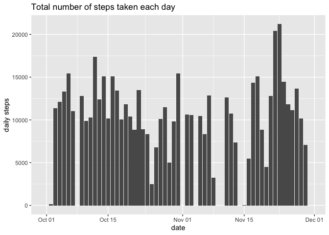
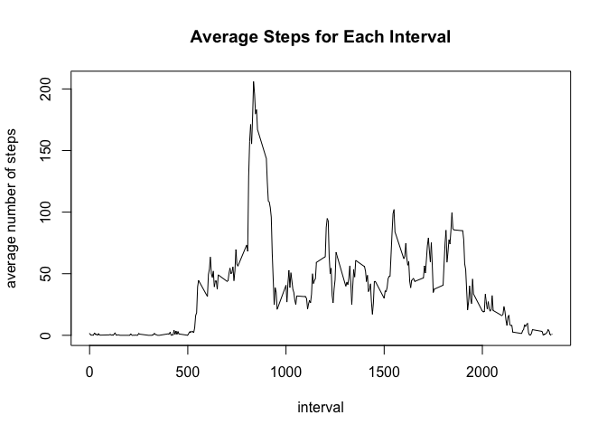
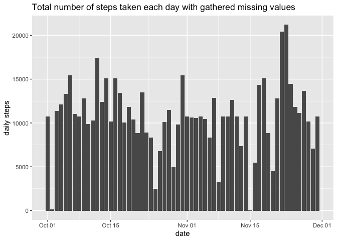
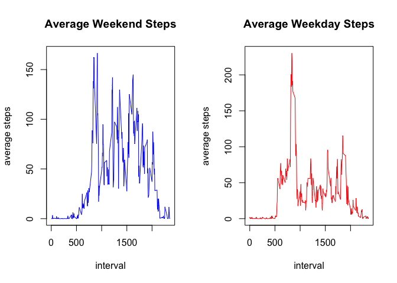

## Introduction
It is now possible to collect a large amount of data about personal movement using activity monitoring devices such as a Fitbit, Nike Fuelband, or Jawbone Up. These type of devices are part of the “quantified self” movement – a group of enthusiasts who take measurements about themselves regularly to improve their health, to find patterns in their behavior, or because they are tech geeks. But these data remain under-utilized both because the raw data are hard to obtain and there is a lack of statistical methods and software for processing and interpreting the data.

This assignment makes use of data from a personal activity monitoring device. This device collects data at 5 minute intervals through out the day. The data consists of two months of data from an anonymous individual collected during the months of October and November, 2012 and include the number of steps taken in 5 minute intervals each day.


The following library are used:


```r
library(dplyr)
```

```
## 
## Attaching package: 'dplyr'
```

```
## The following objects are masked from 'package:stats':
## 
##     filter, lag
```

```
## The following objects are masked from 'package:base':
## 
##     intersect, setdiff, setequal, union
```

```r
library(ggplot2)
```

## Loading and preprocessing the data

First we have to read the data into da data frame and cleaning the data.


```r
act_data <- read.csv("activity.csv")
summary(act_data)
```

```
##      steps            date              interval     
##  Min.   :  0.00   Length:17568       Min.   :   0.0  
##  1st Qu.:  0.00   Class :character   1st Qu.: 588.8  
##  Median :  0.00   Mode  :character   Median :1177.5  
##  Mean   : 37.38                      Mean   :1177.5  
##  3rd Qu.: 12.00                      3rd Qu.:1766.2  
##  Max.   :806.00                      Max.   :2355.0  
##  NA's   :2304
```

```r
act_data$steps <- as.numeric(act_data$steps)
act_data$date <- as.Date(act_data$date)
```

## What is the mean total number of steps taken per day?

### 1. Calculation of the total number of steps taken per day

The total number of steps taken each day is contained in the following data frame. The missing values are ignored.


```r
total_steps_each_day <- act_data %>%
   group_by(date) %>%
   summarise(daily_steps_sum = sum(steps, na.rm = TRUE)) 
```

```
## `summarise()` ungrouping output (override with `.groups` argument)
```

The first 5 raws are as follows:


```r
total_steps_each_day[c(1:5),]
```

```
## # A tibble: 5 x 2
##   date       daily_steps_sum
##   <date>               <dbl>
## 1 2012-10-01               0
## 2 2012-10-02             126
## 3 2012-10-03           11352
## 4 2012-10-04           12116
## 5 2012-10-05           13294
```


### 2. Histogram of the total number of steps taken each day

We create a histogram with ggplot2.


```r
total_steps_each_day %>%
  ggplot(aes(x = date, y = daily_steps_sum)) + 
  geom_bar(stat="identity") + 
  labs(title = "Total number of steps taken each day", y = "daily steps")
```

<!-- -->

### 3. Mean and median of the total number of steps taken each day

Mean and median are calculated as follows:


```r
mean_each_day <- mean(total_steps_each_day$daily_steps_sum)
median_each_day <- median(total_steps_each_day$daily_steps_sum)
```

The mean of the total number of steps taken each day is 9354.2295082.
The median of the total number of steps taken each day is  1.0395\times 10^{4}.

## What is the average daily activity pattern?

### 1. Time series plot of the average number of steps taken

A time series plot of the 5-minute interval (x-axis) and the average number of steps taken, averaged across all days (y-axis) is created in this chapter.

First a new data frame is created, which contains the average steps for each interval. Then plot the average number of steps for each time interval.


```r
average_steps_each_interval <- act_data %>%
  group_by(interval) %>%
  summarise(mean_each_interval = mean(steps, na.rm = TRUE)) 
```

```
## `summarise()` ungrouping output (override with `.groups` argument)
```

```r
average_steps_each_interval %>%  
  plot(type = "l", main = "Average Steps for Each Interval", ylab = "average number of steps")
```

<!-- -->

### 2. Which 5-minute interval, on average across all the days in the dataset, contains the maximum number of steps?


```r
average_steps_each_interval %>%
  filter(mean_each_interval == max(mean_each_interval)) %>%
  select(interval)
```

```
## # A tibble: 1 x 1
##   interval
##      <int>
## 1      835
```

The interval displayed above contains the maximum number of steps.

## Inputing missing values

### 1. The total number of missing values


```r
sum(is.na(act_data$steps))
```

```
## [1] 2304
```

The total number of missing values is 2304.

### 2. Filling the missing data

The missing data are filled with the means of the intervals respectively. 

### 3. Create a new data frame equal to the original data set, but with the missing data filled in.

A new data frame act_data_filled is created with two additional columns: 

* a column for the mean for each interval 
* a column for the number of steps, if this is available, and the interval mean for NA number of steps


```r
act_data_filled <- act_data %>% 
  inner_join(average_steps_each_interval, by = "interval") %>%
  mutate(steps_filled = ifelse(is.na(steps), mean_each_interval, steps))
```

The additional columns, which are not necessary now, are delated.


```r
act_data_filled <- act_data_filled %>%
  select(steps_filled, date, interval)
act_data_filled[c(1:5),]
```

```
##   steps_filled       date interval
## 1    1.7169811 2012-10-01        0
## 2    0.3396226 2012-10-01        5
## 3    0.1320755 2012-10-01       10
## 4    0.1509434 2012-10-01       15
## 5    0.0754717 2012-10-01       20
```

### 4. Histogram of the total number of steps, mean and and median

A histogram of the total number of steps taken each day is created.


```r
steps_each_day_filled <- act_data_filled %>% 
  select(steps_filled, date) %>% 
  group_by(date) %>% 
  summarise(daily_steps_sum = sum(steps_filled)) 
```

```
## `summarise()` ungrouping output (override with `.groups` argument)
```

```r
steps_each_day_filled %>%
  ggplot(aes(x = date, y = daily_steps_sum)) + geom_bar(stat = "identity") +
  labs(title = "Total number of steps taken each day with gathered missing values", y = "daily steps")
```

<!-- -->

```r
# Caclulating mean and value

mean_each_day_filled <- mean(steps_each_day_filled$daily_steps_sum) 
median_each_day_filled <- median(steps_each_day_filled$daily_steps_sum)
```

The mean of the total number of steps with the gathered missing values is 1.0766189\times 10^{4} and the median of the total number of steps with the gathered missing value is 1.0766189\times 10^{4}.

The difference between the mean and median with ignored missing values and with gathered missing value is as follows:


```r
mean_each_day - mean_each_day_filled
```

```
## [1] -1411.959
```

```r
median_each_day - median_each_day_filled
```

```
## [1] -371.1887
```

## Are there differences in activity patterns between weekdays and weekends?

### 1. Creating a factor variable weekday and weekend

First a vector is created for weekends and then a additional factor column is added to the data frame.


```r
# Create vector for weekends
weekends <- c("Saturday", "Sunday")

# Add additional factor column with entry weekday/weekend in the data frame

act_data_weekendday <- act_data_filled %>%
  mutate(weekendday = factor(weekdays(date) %in% weekends, levels = c(TRUE, FALSE), labels = c("weekend", "weekday")))

act_data_weekendday[c(1:5),]
```

```
##   steps_filled       date interval weekendday
## 1    1.7169811 2012-10-01        0    weekday
## 2    0.3396226 2012-10-01        5    weekday
## 3    0.1320755 2012-10-01       10    weekday
## 4    0.1509434 2012-10-01       15    weekday
## 5    0.0754717 2012-10-01       20    weekday
```

### 2. Creating a panel plot for weekdays and weekends


```r
par(mfrow = c(1,2))

act_data_weekendday %>% 
  filter(weekendday == "weekend") %>% 
  group_by(interval) %>% 
  summarise(mean_per_interval_weekend = mean(steps_filled)) %>% 
  plot(main = "Average Weekend Steps", type = "l", col = "blue", ylab = "average steps")
```

```
## `summarise()` ungrouping output (override with `.groups` argument)
```

```r
act_data_weekendday %>% 
  filter(weekendday == "weekday") %>% 
  group_by(interval) %>% 
  summarise(mean_per_interval_weekday = mean(steps_filled)) %>% 
  plot(main = "Average Weekday Steps", type = "l", col = "red", ylab = "average steps")
```

```
## `summarise()` ungrouping output (override with `.groups` argument)
```

<!-- -->

It seems, that on weekdays people are more active in the morning and on weekends, they are active during the whole day.
